# Multi-view MidiVAE: Fusing Track- and Bar-view Representations for Long Multi-track Symbolic Music Generation

### *Zhiwei Lin, Jun Chen, Boshi Tang, Binzhu Sha, Jing Yang, Yaolong Ju, Fan Fan, Shiyin Kang, Zhiyong Wu, Helen Meng*

<h2 id = "1">Abstract</h2>
Variational Autoencoders (VAEs)  constitute a crucial component of neural symbolic music generation, among which some works have yielded outstanding results and attracted considerable attention. Nevertheless, previous VAEs still encounter issues with overly long feature sequences and generated results lack contextual coherence, thus the challenge of modeling long multi-track symbolic music still remains unaddressed. To this end, we propose Multi-view MidiVAE, as one of the pioneers in VAE methods that effectively model and generate long multi-track symbolic music.
The Multi-view MidiVAE utilizes the two-dimensional (2-D) representation, OctupleMIDI, to capture relationships among notes while reducing the feature sequences length. Moreover, we focus on instrumental characteristics and harmony as well as global and local information about the musical composition by employing a hybrid variational encoding-decoding strategy to integrate both Track- and Bar-view MidiVAE features. Objective and subjective experimental results on the CocoChorales dataset demonstrate that, compared to the baseline, Multi-view MidiVAE exhibits significant improvements in terms of modeling long multi-track symbolic music. 

    
	
    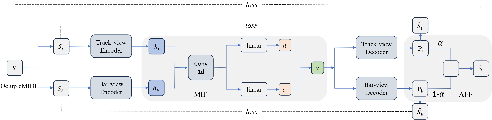
     
    
 
    Fig.1: The overall diagram of the proposed Multi-view MidiVAE. The model mainly contains Track- and Bar-view encoders, a multi-view information fusion (MIF), Track- and Bar-view decoders as well as an adaptive feature fusion (AFF).
    

## Latent Space Sample Demos

<h3 id = "3"> MusicVAE with REMI+</h3>

|                          **MusicVAE with REMI+**                          |                                                              |
| :----------------------------------------------------------: | :----------------------------------------------------------: |
| **case 1**  <audio controls><source src="./data/samples/MusicVAE_REMIplus/1.wav" type="audio/wav">Your browser does not support the audio element.</audio> | **case 2**    <audio controls><source src="./data/samples/MusicVAE_REMIplus/2.wav" type="audio/wav">Your browser does not support the audio element.</audio> |
| 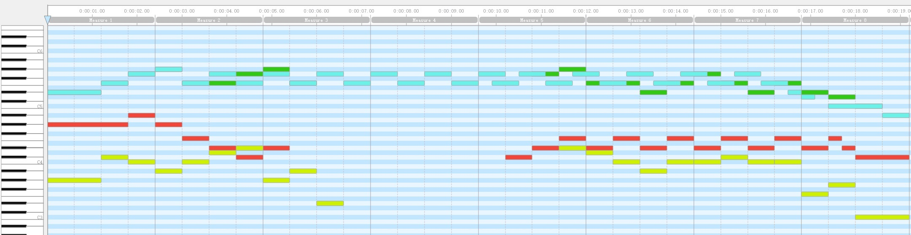 | 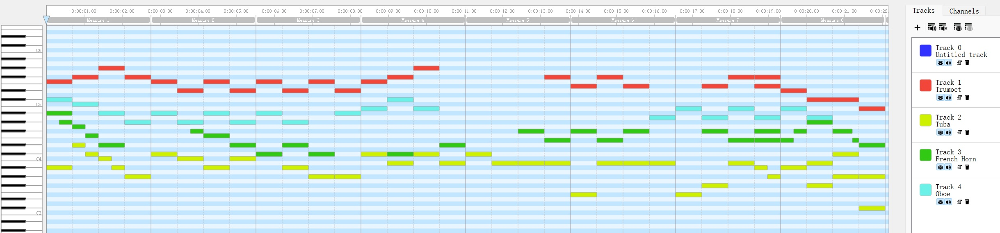 |
| **case 3**   <audio controls><source src="./data/samples/MusicVAE_REMIplus/3.wav" type="audio/wav">Your browser does not support the audio element.</audio> | **case 4**   <audio controls><source src="./data/samples/MusicVAE_REMIplus/4.wav" type="audio/wav">Your browser does not support the audio element.</audio> |
| 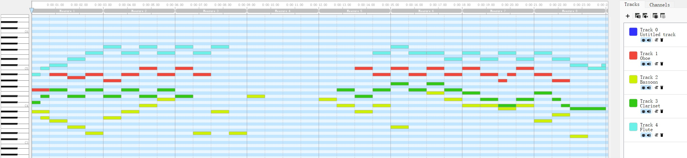 | 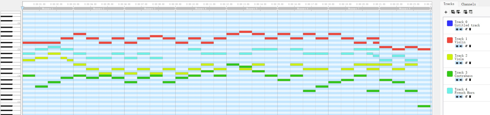 |

<h3 id = "3"> MusicVAE with OctupleMIDI</h3>

|                          **MusicVAE with OctupleMIDI**                          |                                                              |
| :----------------------------------------------------------: | :----------------------------------------------------------: |
| **case 1**  <audio controls><source src="./data/samples/MusicVAE_OctupleMIDI/1.wav" type="audio/wav">Your browser does not support the audio element.</audio> | **case 2**    <audio controls><source src="./data/samples/MusicVAE_OctupleMIDI/2.wav" type="audio/wav">Your browser does not support the audio element.</audio> |
| 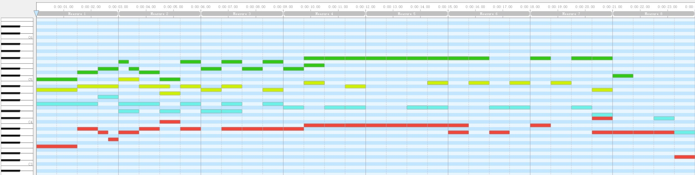 | 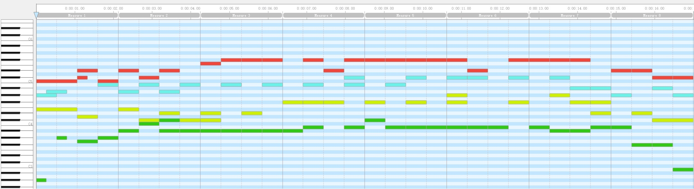 |
| **case 3**   <audio controls><source src="./data/samples/MusicVAE_OctupleMIDI/3.wav" type="audio/wav">Your browser does not support the audio element.</audio> | **case 4**   <audio controls><source src="./data/samples/MusicVAE_OctupleMIDI/4.wav" type="audio/wav">Your browser does not support the audio element.</audio> |
| 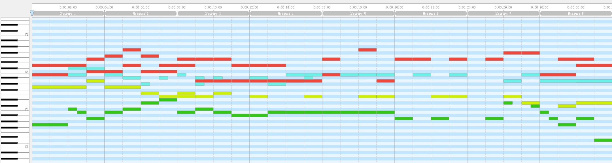 | 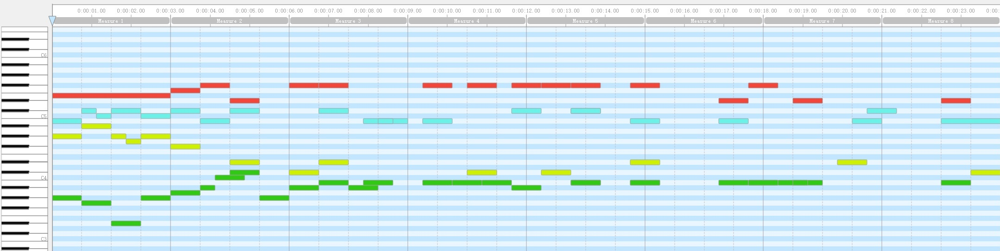 |

<h3 id = "3"> Bar-view MidiVAE</h3>

|                          **Bar-view MidiVAE**                          |                                                              |
| :----------------------------------------------------------: | :----------------------------------------------------------: |
| **case 1**  <audio controls><source src="./data/samples/B-view/1.wav" type="audio/wav">Your browser does not support the audio element.</audio> | **case 2**    <audio controls><source src="./data/samples/B-view/2.wav" type="audio/wav">Your browser does not support the audio element.</audio> |
| 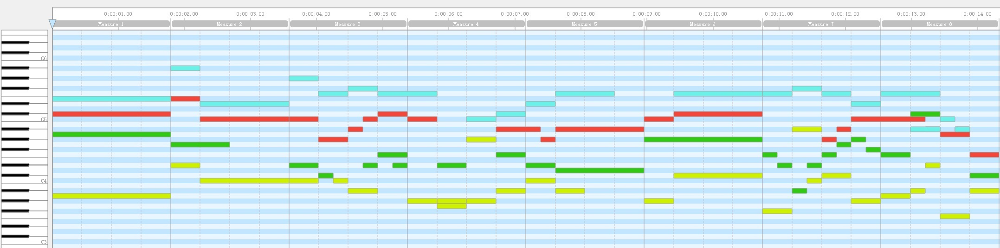 | 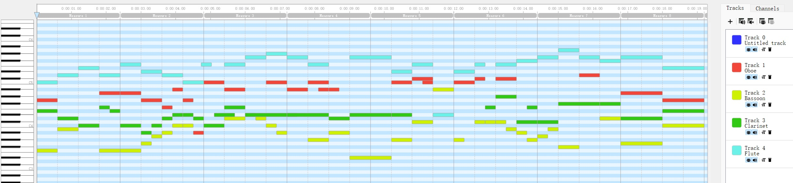 |
| **case 3**   <audio controls><source src="./data/samples/B-view/3.wav" type="audio/wav">Your browser does not support the audio element.</audio> | **case 4**   <audio controls><source src="./data/samples/B-view/4.wav" type="audio/wav">Your browser does not support the audio element.</audio> |
| 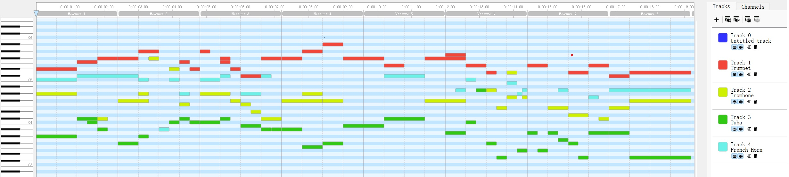 | 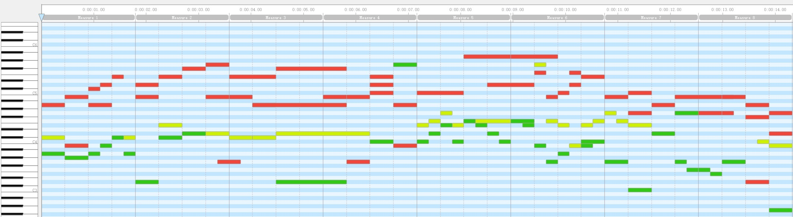 |

<h3 id = "3"> Track-view MidiVAE</h3>

|                          **Track-view MidiVAE**                          |                                                              |
| :----------------------------------------------------------: | :----------------------------------------------------------: |
| **case 1**  <audio controls><source src="./data/samples/T-view/1.wav" type="audio/wav">Your browser does not support the audio element.</audio> | **case 2**    <audio controls><source src="./data/samples/T-view/2.wav" type="audio/wav">Your browser does not support the audio element.</audio> |
| 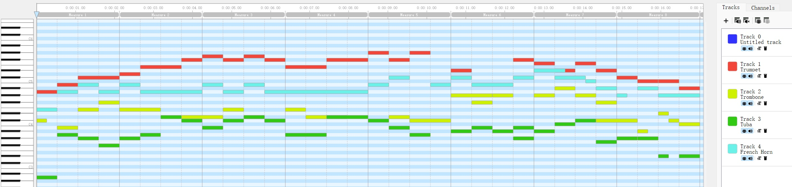 | 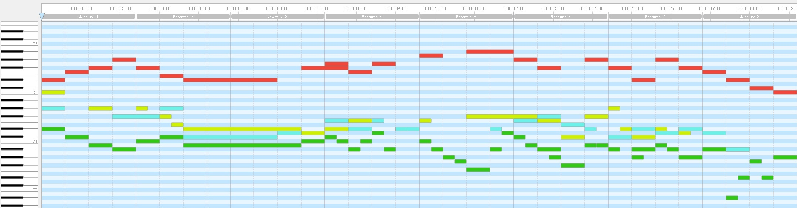 |
| **case 3**   <audio controls><source src="./data/samples/T-view/3.wav" type="audio/wav">Your browser does not support the audio element.</audio> | **case 4**   <audio controls><source src="./data/samples/T-view/4.wav" type="audio/wav">Your browser does not support the audio element.</audio> |
| 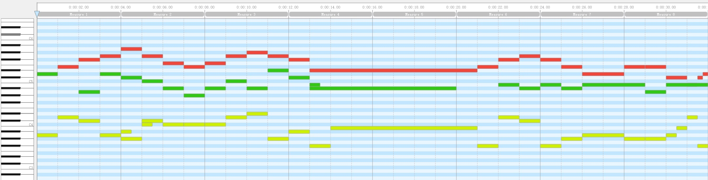 | 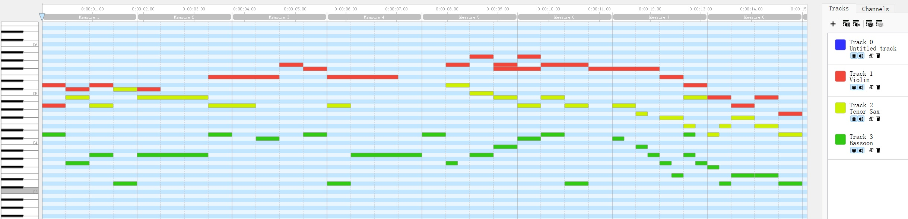 |

<h3 id = "3"> Multi-view MidiVAE</h3>

|                          **Multi-view MidiVAE**                          |                                                              |
| :----------------------------------------------------------: | :----------------------------------------------------------: |
| **case 1**  <audio controls><source src="./data/samples/Multi-View/1.wav" type="audio/wav">Your browser does not support the audio element.</audio> | **case 2**    <audio controls><source src="./data/samples/Multi-View/2.wav" type="audio/wav">Your browser does not support the audio element.</audio> |
| 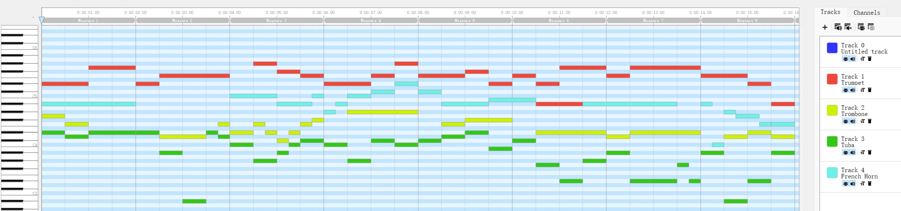 | 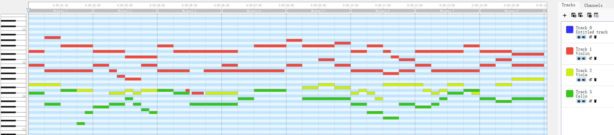 |
| **case 3**   <audio controls><source src="./data/samples/Multi-View/3.wav" type="audio/wav">Your browser does not support the audio element.</audio> | **case 4**   <audio controls><source src="./data/samples/Multi-View/4.wav" type="audio/wav">Your browser does not support the audio element.</audio> |
| 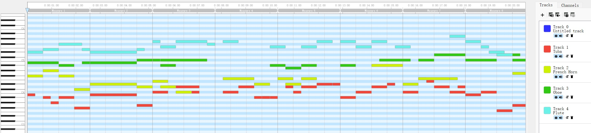 |  |

## Latent Space Interpolation Demos

<h3 id = "3"> case 1</h3>

|                          **case 1**                          |                                                              |
| :----------------------------------------------------------: | :----------------------------------------------------------: |
| **Start**  <audio controls><source src="./data/Interpolation/case1/s.wav" type="audio/wav">Your browser does not support the audio element.</audio> | **End**    <audio controls><source src="./data/Interpolation/case1/e.wav" type="audio/wav">Your browser does not support the audio element.</audio> |
| 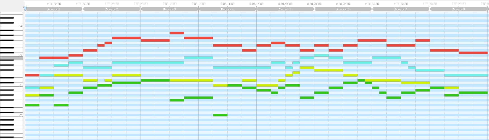 | 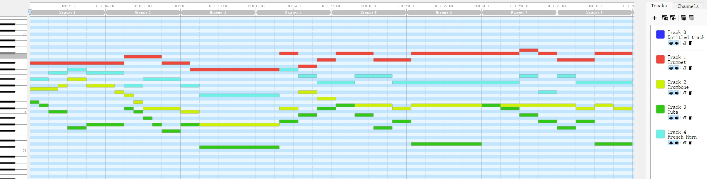 |
| **MusicVAE with REMI+**   <audio controls><source src="./data/Interpolation/case1/MusicVAE_REMI.wav" type="audio/wav">Your browser does not support the audio element.</audio> | **MusicVAE with OctupleMIDI**   <audio controls><source src="./data/Interpolation/case1/MusicVAE_Oct.wav" type="audio/wav">Your browser does not support the audio element.</audio> |
| 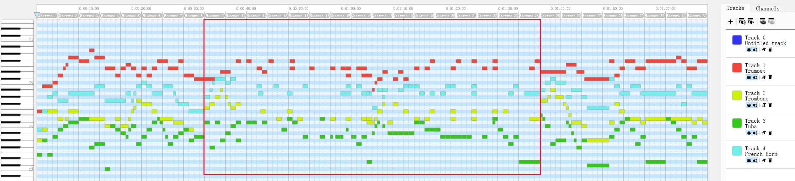 | 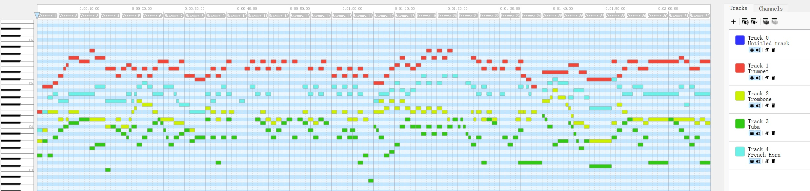 |
| **Bar-view MidiVAE**   <audio controls><source src="./data/Interpolation/case1/B-view.wav" type="audio/wav">Your browser does not support the audio element.</audio> | **Track-view MidiVAE**   <audio controls><source src="./data/Interpolation/case1/T-view.wav" type="audio/wav">Your browser does not support the audio element.</audio> |
| 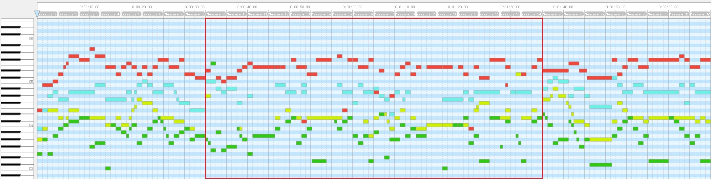 | 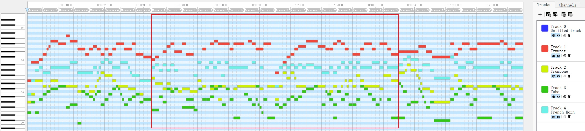 |
| **Multi-view MidiVAE**   <audio controls><source src="./data/Interpolation/case1/Multi-view.wav" type="audio/wav">Your browser does not support the audio element.</audio> |
| 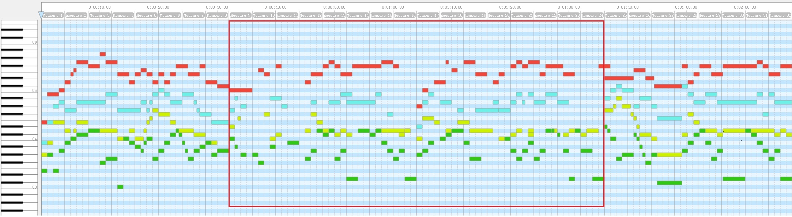 |

<h3 id = "3"> case 2</h3>

|                          **case 2**                          |                                                              |
| :----------------------------------------------------------: | :----------------------------------------------------------: |
| **Start**  <audio controls><source src="./data/Interpolation/case2/s.wav" type="audio/wav">Your browser does not support the audio element.</audio> | **End**    <audio controls><source src="./data/Interpolation/case2/e.wav" type="audio/wav">Your browser does not support the audio element.</audio> |
| 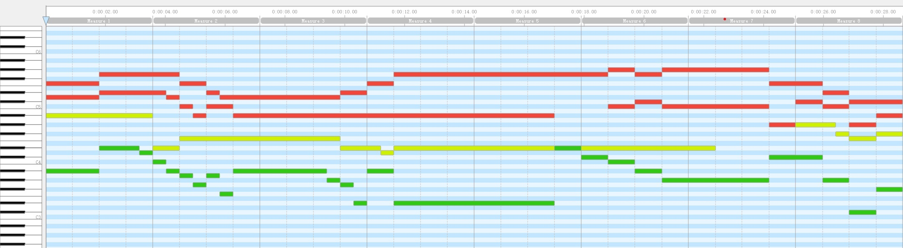 | 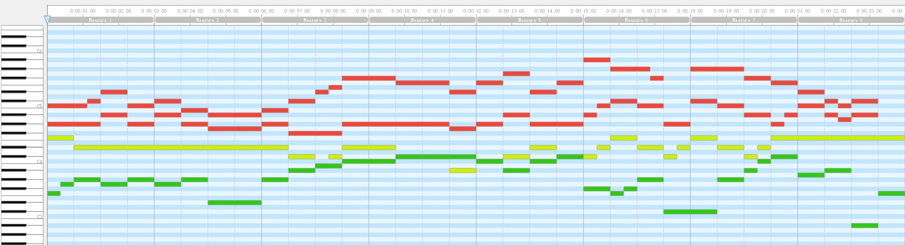 |
| **MusicVAE with REMI+**   <audio controls><source src="./data/Interpolation/case2/MusicVAE_REMI.wav" type="audio/wav">Your browser does not support the audio element.</audio> | **MusicVAE with OctupleMIDI**   <audio controls><source src="./data/Interpolation/case2/MusicVAE_Oct.wav" type="audio/wav">Your browser does not support the audio element.</audio> |
| 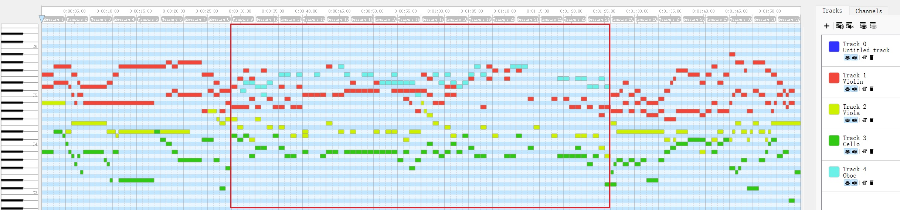 | 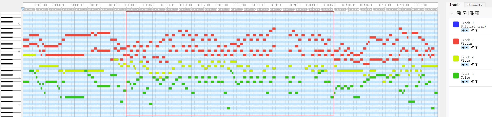 |
| **Bar-view MidiVAE**   <audio controls><source src="./data/Interpolation/case2/B-view.wav" type="audio/wav">Your browser does not support the audio element.</audio> | **Track-view MidiVAE**   <audio controls><source src="./data/Interpolation/case2/T-view.wav" type="audio/wav">Your browser does not support the audio element.</audio> |
| 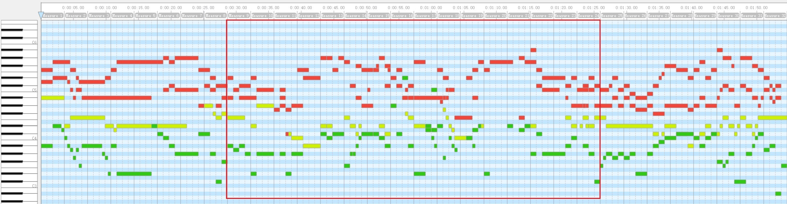 | 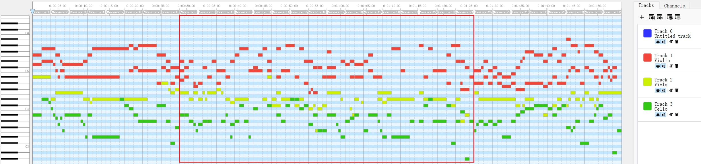 |
| **Multi-view MidiVAE**   <audio controls><source src="./data/Interpolation/case2/Multi-view.wav" type="audio/wav">Your browser does not support the audio element.</audio> |
| 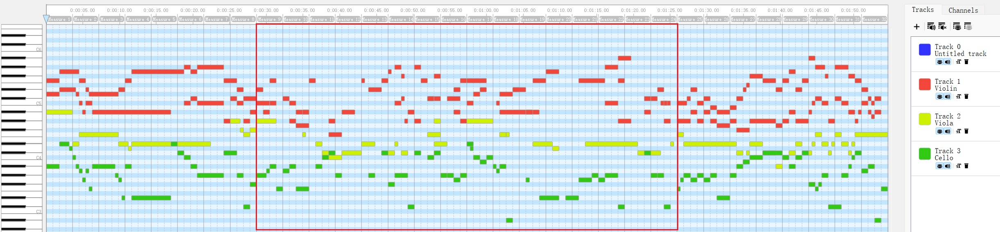 |

